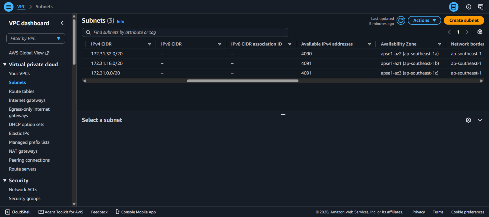
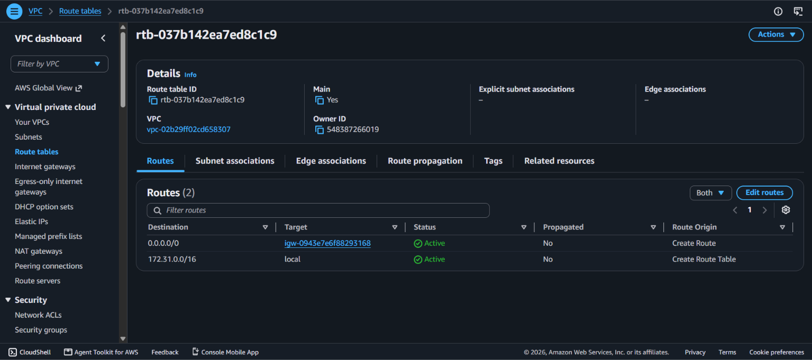
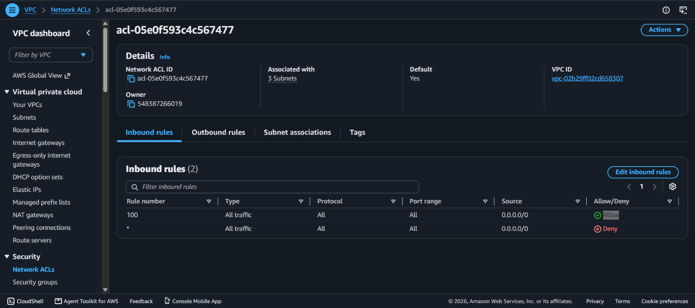
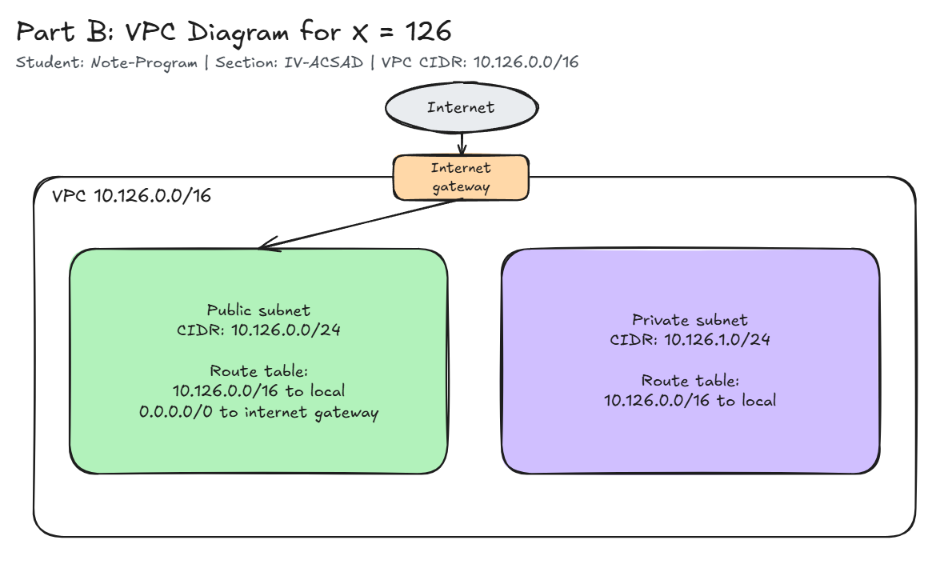

# Assignment 2 Submission

<!--
How to use this template:

1. Copy this file to submissions/assignment-2/<your-github-username>/submission.md
2. Replace every answer placeholder with your own answer. Delete the angle brackets too.
3. Save your four images in the same folder, with the exact file names below.
4. Do not write your full name or your student number in this file.
-->

## About me

- GitHub username: Note-Program
- Section: IV-ACSAD
- IAM user name that I signed in with: acsad-g04
- X: 126

---

## Part A. Explore

### A1. The VPC

Default VPC IPv4 CIDR:

172.31.0.0/16

Number of addresses in that CIDR:

65,536

### A2. The subnets

| Availability Zone | IPv4 CIDR |
| --- | --- |
| apse1-az2 (ap-southeast-1a) | 172.31.32.0/20 |
| apse1-az1 (ap-southeast-1b) | 172.31.16.0/20 |
| apse1-az3 (ap-southeast-1c) | 172.31.0.0/20 |

Screenshot 1. Save it as `screenshot-1-subnets.png` in your folder. The image line below shows it.

### A3. Available addresses

Available IPv4 addresses in each subnet:

apse1-az2 (ap-southeast-1a): 4090
apse1-az1 (ap-southeast-1b): 4091
apse1-az3 (ap-southeast-1c): 4091

Why is the number lower than 4,096?

A `/20` subnet has 4,096 addresses, but AWS reserves 5 addresses in every subnet (the first four and the last one) for networking and management purposes. Therefore, an empty subnet has 4,096 − 5 = 4,091 available addresses.

What uses the missing address in the subnet with the lowest number?

A network interface (ENI) attached to an EC2 instance (from Lab 2) uses the address. Even when the instance is stopped, its network interface remains in the subnet and retains its private IPv4 address.

### A4. The route table

| Destination | Target |
| --- | --- |
| 0.0.0.0/0 | igw-0943e7e6f88293168 |
| 172.31.0.0/16 | local |

Screenshot 2. Save it as `screenshot-2-routes.png` in your folder. The image line below shows it.

### A5. Public or private

Are the default subnets public or private? Which route proves it?

Public. The route `0.0.0.0/0` targeting the internet gateway (`igw-0943e7e6f88293168`) proves it.

### A6. The internet gateway

State of the internet gateway:

Attached

What happens to the default subnets if the gateway is detached?

The route `0.0.0.0/0` loses its target (enters a blackhole state), so the subnets lose all access to and from the internet. However, instances in the subnets can still communicate with each other within the VPC via the `local` route (`172.31.0.0/16`).

### A7. NAT gateways

Number of NAT gateways:

0

Can a server in a new private subnet download updates? Why?

No. A private subnet has no direct route to an internet gateway, and there are currently no NAT gateways in this VPC (count is 0). For the server to download updates, a NAT gateway must first be created in a public subnet, and a route `0.0.0.0/0` targeting that NAT gateway must be added to the private subnet's route table.

### A8. The network ACL

| Rule number | Source | Allow or Deny |
| --- | --- | --- |
| 100 | 0.0.0.0/0 | Allow |
| * | 0.0.0.0/0 | Deny |

How is a network ACL different from a security group?

A network ACL protects an entire subnet and processes numbered allow/deny rules in order, while a security group protects individual resources (like an EC2 instance) with allow rules only. Furthermore, network ACLs are stateless (inbound and outbound traffic require separate rules), whereas security groups are stateful (replies are automatically allowed).

Screenshot 3. Save it as `screenshot-3-network-acl.png` in your folder. The image line below shows it.

### A9. The default security group

Inbound rule (type and source):

Type: All traffic
Source: sg-0c5b6d4081cf0a534

Which resources can send traffic to an instance that uses it?

Only resources (such as other EC2 instances) that are assigned the same `default` security group (`sg-0c5b6d4081cf0a534`). Because the source is the security group itself and no other inbound rules exist, all traffic from any other source (including the internet) is blocked.

---

## Part B. Prepare

### B1. Plan two subnets

- Public subnet CIDR: 10.126.0.0/24
- Private subnet CIDR: 10.126.1.0/24

### B2. Route tables

Route table of the public subnet:

| Destination | Target |
| --- | --- |
| 10.126.0.0/16 | local |
| 0.0.0.0/0 | internet gateway |

Route table of the private subnet:

| Destination | Target |
| --- | --- |
| 10.126.0.0/16 | local |

### B3. My VPC diagram

Tool used (Excalidraw, draw.io, Lucidchart, or paper):

Excalidraw

Save your diagram as `vpc-diagram.png` in your folder. The image line below shows it.

### B4. Predict a change

Can you still open the web page from your laptop? Why?

No. The laptop connects over the public internet. Without the default route `0.0.0.0/0` pointing to the internet gateway in the route table, the instance has no path to send response packets back to your laptop over the internet. Having a public IP address alone is not enough without an active route to the internet gateway.

Can the instance still reach another instance in the VPC? Why?

Yes. The `local` route (`172.31.0.0/16`) is still present in the route table, which allows internal network traffic between all subnets and instances within the same VPC.

### B5. Place a database

Which subnet gets the database? Why?

The private subnet (`10.126.1.0/24`). Because its route table does not contain a route to the internet gateway, it cannot be reached or scanned directly from the public internet. This protects sensitive data while still allowing application and web servers in the public subnet to connect to the database internally over the `local` route.

### B6. My question about VPCs

What is your question, and what made you think of it?

If two VPCs in the same AWS account have overlapping CIDRs (such as two default VPCs both using `172.31.0.0/16`), can they be connected using VPC Peering, or must their address ranges be completely distinct? I thought of this because many default AWS accounts and regions share the same `172.31.0.0/16` range.
